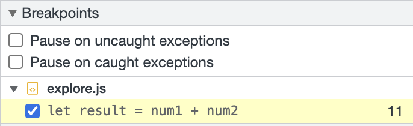
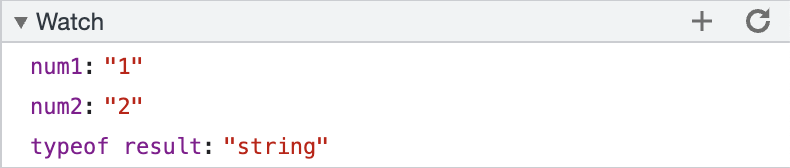
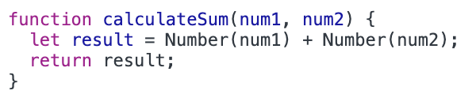

1. The bug is that calculateSum is concatenating strings num1 and num2 instead of doing arithmetic.
2. To fix it, we need to convert num1 and num2 to numbers and then add them so that we are doing arithmetic instead.
